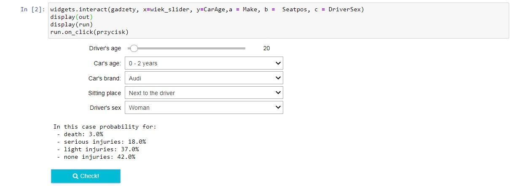

## Aplication preview

### In which situation you should feel more safety in case of accident?

---

Using the fatalityfacts database, available at [link](https://www.kaggle.com/cfurby243/fatalityfacts), I 've analyzed 51,978 accidents between 2004 and 2015  year,
- There were only accidents in this database.
- I examined that on average 2.13 people participated in the accidents.
- For the purposes of the analysis, i used only those cases related to passenger cars.

Final application looks like below:

